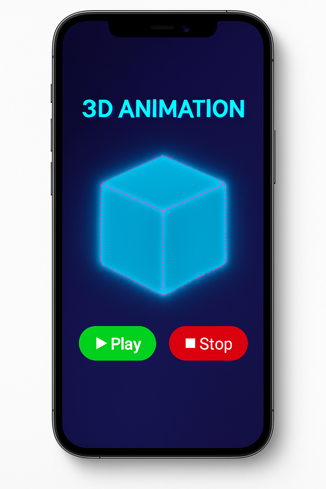

# 3D Rotating Cube Animation

This project is a **3D rotating cube with interactive Play and Stop controls**.  
The cube rotates in 3D space using CSS animations, and users can start or stop the animation with buttons.

---

## 🖥️ Live Demo
[Click Here to View](https://3-d-rotating-cube-animation.vercel.app/) 

---

## 📂 Project Structure

3d-rotating-cube/
│
├── index.html # Main HTML file
├── style.css # Styles (included inline in HTML)
└── script.js # JavaScript for controls (included inline in HTML)


---

## 🚀 Features
- Beautiful **3D cube** using CSS `transform` and `perspective`.
- Smooth **infinite rotation animation**.
- **Play** and **Stop** buttons to control the animation.
- Gradient background and glowing cube effect.

---

## 🛠️ How to Run Locally
Follow these steps:

1. **Clone the repository**
   ```bash
   git clone https://github.com/lifeonthecode/3D-Rotating-Cube-Animation.git


Navigate into the folder

cd 3d-rotating-cube
Open the index.html file in your browser:

On Windows:
start index.html

On macOS:
open index.html

Or simply drag and drop it into your browser.

## 📷 Preview



⚡ Controls
▶ Play – Starts the cube rotation.

⏹ Stop – Pauses the cube rotation.

📜 License
This project is open-source and free to use.

✨ Author
Created by Lifeonthecode.

